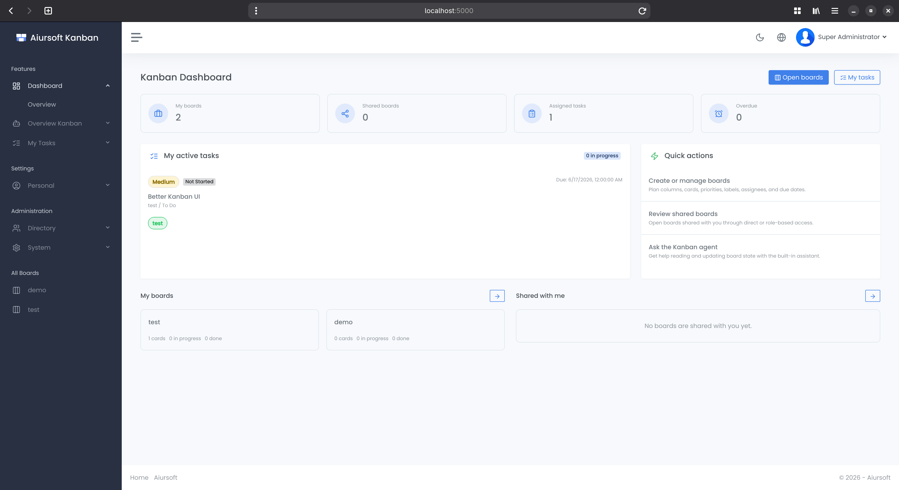

# Kanban

An optional native .NET Android client is available. See [Android app and OIDC deployment](docs/android.md)
for identity-provider registration, server settings, APK building, and sideloading.

[](https://github.com/aiursoftweb/kanban/blob/master/LICENSE)
[](https://gitlab.aiursoft.com/aiursoft/kanban/-/pipelines)
[](https://gitlab.aiursoft.com/aiursoft/kanban/-/pipelines)
[](https://manhours.aiursoft.com/r/github.com/aiursoftweb/kanban.html)
[](https://kanban.aiursoft.com)
[](https://hub.docker.com/r/aiursoft/kanban)

Aiursoft Kanban is a self-hosted project management and workflow planning system built on ASP.NET Core (.NET 10). It helps teams organize boards, columns, cards, labels, priorities, assignees, due dates, comments, and shared access in one lightweight web application.



Default user name is `admin@default.com` and default password is `Admin@123456!`.

## Try

Try a running Kanban [here](https://kanban.aiursoft.com).

## Why Kanban for Your Organization

Kanban provides a practical workspace for teams that need transparent task flow without adopting a heavyweight project management suite. It is designed for self-hosting, fast deployment, and clear ownership of your workflow data.

Key features include:

**Board-Centered Planning.** Create boards with ordered columns, move cards across workflow states, and keep project work visible from planning to completion.

**Task Ownership and Priorities.** Assign cards to users, set priorities and due dates, track overdue work, and use the dashboard to focus on active responsibilities.

**Flexible Sharing.** Share boards with specific users or roles, choose read-only or editable access, and keep private boards isolated from unrelated teams.

**Team-Ready Collaboration.** Use labels, comments, card descriptions, public board links, and the built-in Kanban assistant to coordinate work across a team.

**Self-Hosted Infrastructure.** Run with SQLite for small deployments, MySQL for production scale, or in-memory storage for tests while keeping authentication, RBAC, localization, Docker deployment, and system management in the same application.

## Run in Ubuntu

The following script will install\update this app on your Ubuntu server. Supports Ubuntu 25.04.

On your Ubuntu server, run the following command:

```bash
curl -sL https://github.com/aiursoftweb/kanban/raw/master/install.sh | sudo bash
```

Of course it is suggested that append a custom port number to the command:

```bash
curl -sL https://github.com/aiursoftweb/kanban/raw/master/install.sh | sudo bash -s 8080
```

It will install the app as a systemd service, and start it automatically. Binary files will be located at `/opt/apps`. Service files will be located at `/etc/systemd/system`.

## Run manually

Requirements about how to run

1. Install [.NET 10 SDK](http://dot.net/) and [Node.js](https://nodejs.org/).
2. Execute `npm install` at `wwwroot` folder to install the dependencies.
3. Execute `dotnet run` to run the app.
4. Use your browser to view [http://localhost:5000](http://localhost:5000).

## Run in Microsoft Visual Studio

1. Open the `.sln` file in the project path.
2. Press `F5` to run the app.

## Run in Docker

First, install Docker [here](https://docs.docker.com/get-docker/).

Then run the following commands in a Linux shell:

```bash
image=aiursoft/kanban
appName=kanban
sudo docker pull $image
sudo docker run -d --name $appName --restart unless-stopped -p 5000:5000 -v /var/www/$appName:/data $image
```

That will start a web server at `http://localhost:5000` and you can test the app.

The docker image has the following context:

| Properties  | Value                           |
|-------------|---------------------------------|
| Image       | aiursoft/kanban                 |
| Ports       | 5000                            |
| Binary path | /app                            |
| Data path   | /data                           |
| Config path | /data/appsettings.json          |

## How to contribute

There are many ways to contribute to the project: logging bugs, submitting pull requests, reporting issues, and creating suggestions.

Even if you with push rights on the repository, you should create a personal fork and create feature branches there when you need them. This keeps the main repository clean and your workflow cruft out of sight.

We're also interested in your feedback on the future of this project. You can submit a suggestion or feature request through the issue tracker. To make this process more effective, we're asking that these include more information to help define them more clearly.
